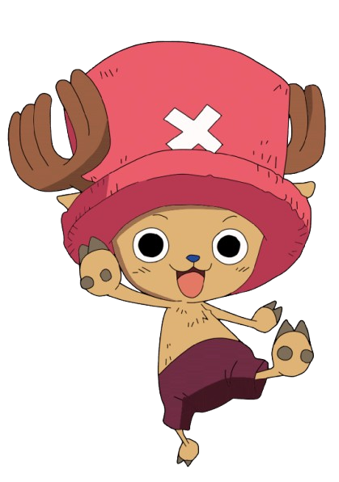

# Evaluate Banner Documentation

## Overview
Complete documentation for the banner component in the student evaluation form (`student/evaluate.php`). This includes all CSS styles, HTML structure, animations, and debugging information.

## HTML Structure

```html
<!-- Flash Banner Header -->
<div class="flash-banner-container">
    <div class="banner-decoration-left"></div>
    <div class="banner-main-content">
        
        <h2 class="banner-title-flash">Junior High Faculty Evaluation System</h2>
    </div>
    <div class="banner-decoration-right">
        
    </div>
</div>
```

## CSS Styles

### Main Banner Container
```css
.flash-banner-container {
    position: relative;
    width: 100%;
    height: 140px;
    margin-bottom: 25px;
    background: linear-gradient(135deg, #ffffff 0%, #f8f9fa 20%, #dc2626 80%, #800000 100%);
    border-radius: 15px;
    box-shadow: 0 10px 30px rgba(0,0,0,0.15);
    border: 3px solid rgba(220, 38, 38, 0.3);
    overflow: hidden;
    display: flex;
    align-items: center;
    justify-content: space-between;
    padding: 20px 30px;
    animation: flashPulse 4s ease-in-out infinite;
}

.flash-banner-container::before {
    content: '';
    position: absolute;
    top: -50%;
    left: -50%;
    width: 200%;
    height: 200%;
    background: linear-gradient(45deg, transparent 30%, rgba(255,255,255,0.3) 50%, transparent 70%);
    animation: flashSweep 3s ease-in-out infinite;
    pointer-events: none;
}
```

### Banner Main Content (Center)
```css
.banner-main-content {
    display: flex;
    flex-direction: column;
    align-items: center;
    flex: 1;
    text-align: center;
    z-index: 2;
    position: relative;
}

.banner-logo-flash {
    width: 60px;
    height: 60px;
    margin-bottom: 10px;
    border-radius: 50%;
    box-shadow: 0 6px 20px rgba(0,0,0,0.2);
    animation: logoFloat 2s ease-in-out infinite alternate;
}

.banner-title-flash {
    font-size: 1.3rem;
    font-weight: 800;
    color: #1f2937;
    text-shadow: 2px 2px 4px rgba(255,255,255,0.8);
    margin: 0;
    letter-spacing: 0.8px;
    line-height: 1.3;
    animation: titleGlow 2s ease-in-out infinite alternate;
}

.banner-subtitle {
    font-size: 0.9rem;
    color: #4b5563;
    margin-left: 5px;
    font-weight: 500;
    text-shadow: 1px 1px 2px rgba(255,255,255,0.6);
}
```

### Left Decoration
```css
.banner-decoration-left {
    position: absolute;
    left: 20px;
    top: 50%;
    transform: translateY(-50%);
    width: 80px;
    height: 80px;
    background: radial-gradient(circle, rgba(255,107,180,0.3) 0%, rgba(255,107,180,0.1) 70%, transparent 100%);
    border-radius: 50%;
    animation: decorationPulse 3s ease-in-out infinite;
}
```

### Right Decoration (Chopper Character)
```css
.banner-decoration-right {
    position: absolute;
    right: 20px;
    top: 50%;
    transform: translateY(-50%);
    width: 100px;
    height: 100px;
    animation: olapBounce 3s ease-in-out infinite;
    filter: drop-shadow(0 6px 12px rgba(0,0,0,0.2));
    z-index: 3;
}

.banner-decoration-right img {
    width: 100%;
    height: 100%;
    object-fit: contain;
    animation: rainbowFilter 3s linear infinite;
}

.banner-decoration-right::before {
    content: '';
    position: absolute;
    top: -15px;
    left: -15px;
    right: -15px;
    bottom: -15px;
    background: radial-gradient(circle, rgba(255,182,193,0.4) 0%, rgba(255,182,193,0.1) 50%, transparent 80%);
    border-radius: 50%;
    animation: olapGlow 2s ease-in-out infinite alternate;
}

.banner-decoration-right::after {
    content: '✨💫';
    position: absolute;
    top: -10px;
    right: -5px;
    font-size: 1.2rem;
    animation: sparkleRotate 4s linear infinite;
}
```

## Animations

### Banner Pulse Animation
```css
@keyframes flashPulse {
    0%, 100% {
        box-shadow: 0 10px 30px rgba(0,0,0,0.15);
        transform: scale(1);
    }
    50% {
        box-shadow: 0 15px 40px rgba(220, 38, 38, 0.3);
        transform: scale(1.02);
    }
}
```

### Flash Sweep Effect
```css
@keyframes flashSweep {
    0% {
        transform: translateX(-100%) translateY(-100%) rotate(45deg);
    }
    50% {
        transform: translateX(0%) translateY(0%) rotate(45deg);
    }
    100% {
        transform: translateX(100%) translateY(100%) rotate(45deg);
    }
}
```

### Logo Float Animation
```css
@keyframes logoFloat {
    0% {
        transform: translateY(0px);
    }
    100% {
        transform: translateY(-8px);
    }
}
```

### Title Glow Animation
```css
@keyframes titleGlow {
    0% {
        text-shadow: 2px 2px 4px rgba(255,255,255,0.8);
    }
    100% {
        text-shadow: 2px 2px 4px rgba(255,255,255,0.8), 0 0 15px rgba(220, 38, 38, 0.4);
    }
}
```

### Left Decoration Pulse
```css
@keyframes decorationPulse {
    0%, 100% {
        opacity: 0.6;
        transform: translateY(-50%) scale(1);
    }
    50% {
        opacity: 1;
        transform: translateY(-50%) scale(1.2);
    }
}
```

### Chopper Bounce Animation
```css
@keyframes olapBounce {
    0%, 100% {
        transform: translateY(-50%) translateX(0px) rotate(0deg);
    }
    25% {
        transform: translateY(-60%) translateX(-5px) rotate(-3deg);
    }
    50% {
        transform: translateY(-40%) translateX(0px) rotate(0deg);
    }
    75% {
        transform: translateY(-55%) translateX(5px) rotate(3deg);
    }
}
```

### Chopper Glow Effect
```css
@keyframes olapGlow {
    0% {
        opacity: 0.4;
        transform: scale(1);
    }
    100% {
        opacity: 0.8;
        transform: scale(1.15);
    }
}
```

### Sparkle Rotation
```css
@keyframes sparkleRotate {
    0% {
        transform: rotate(0deg) scale(1);
        opacity: 1;
    }
    25% {
        transform: rotate(90deg) scale(1.2);
        opacity: 0.8;
    }
    50% {
        transform: rotate(180deg) scale(1);
        opacity: 1;
    }
    75% {
        transform: rotate(270deg) scale(1.2);
        opacity: 0.8;
    }
    100% {
        transform: rotate(360deg) scale(1);
        opacity: 1;
    }
}
```

### Rainbow Color Filter (Chopper)
```css
@keyframes rainbowFilter {
    0% {
        filter: hue-rotate(0deg) saturate(1.2) brightness(1.1);
    }
    16.66% {
        filter: hue-rotate(60deg) saturate(1.3) brightness(1.2);
    }
    33.33% {
        filter: hue-rotate(120deg) saturate(1.4) brightness(1.1);
    }
    50% {
        filter: hue-rotate(180deg) saturate(1.3) brightness(1.2);
    }
    66.66% {
        filter: hue-rotate(240deg) saturate(1.4) brightness(1.1);
    }
    83.33% {
        filter: hue-rotate(300deg) saturate(1.3) brightness(1.2);
    }
    100% {
        filter: hue-rotate(360deg) saturate(1.2) brightness(1.1);
    }
}
```

## Debugging Guide

### Common Issues and Solutions

#### 1. Chopper Image Not Displaying
**Problem**: `olap.png` not showing in banner
**Solutions**:
- Check file path: `./assets/img/olap.png` (relative to student folder)
- Verify file exists in `c:\xampp\htdocs\eval\assets\img\olap.png`
- Clear browser cache (Ctrl+F5)
- Check browser console for 404 errors

#### 2. Animations Not Working
**Problem**: CSS animations not playing
**Solutions**:
- Check CSS syntax for typos
- Verify animation names match between CSS rules and keyframes
- Test in different browsers
- Check if `animation` property is being overridden

#### 3. Banner Layout Issues
**Problem**: Elements not positioned correctly
**Solutions**:
- Check `position: absolute` vs `position: relative`
- Verify `z-index` values for layering
- Check `transform` properties for positioning
- Test responsive behavior on different screen sizes

#### 4. Color/Filter Issues
**Problem**: Rainbow colors not showing or looking wrong
**Solutions**:
- Check `filter` property support in browser
- Verify `hue-rotate()` values (0-360deg)
- Test `saturate()` and `brightness()` values
- Check if other filters are conflicting

### File Locations
- **Main File**: `c:\xampp\htdocs\eval\student\evaluate.php`
- **Chopper Image**: `c:\xampp\htdocs\eval\assets\img\olap.png`
- **School Logo**: `c:\xampp\htdocs\eval\assets\img\logo.png`

### Animation Timings
- **Banner Pulse**: 4 seconds
- **Flash Sweep**: 3 seconds  
- **Logo Float**: 2 seconds (alternate)
- **Title Glow**: 2 seconds (alternate)
- **Decoration Pulse**: 3 seconds
- **Chopper Bounce**: 3 seconds
- **Chopper Glow**: 2 seconds (alternate)
- **Sparkle Rotate**: 4 seconds
- **Rainbow Filter**: 3 seconds

### CSS Line Numbers (Approximate)
- Banner Container: Lines 87-102
- Main Content: Lines 116-152
- Left Decoration: Lines 154-164
- Right Decoration (Chopper): Lines 166-198
- Animations: Lines 200-329

### Quick Modifications
To modify specific aspects:
- **Banner Height**: Change `height: 140px` in `.flash-banner-container`
- **Chopper Size**: Change `width/height: 100px` in `.banner-decoration-right`
- **Animation Speed**: Modify duration values in `@keyframes`
- **Colors**: Update gradient values in `background` properties
- **Position**: Adjust `left/right/top` values in decoration classes
